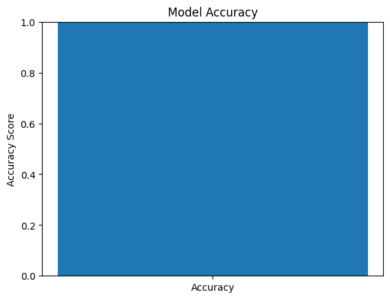
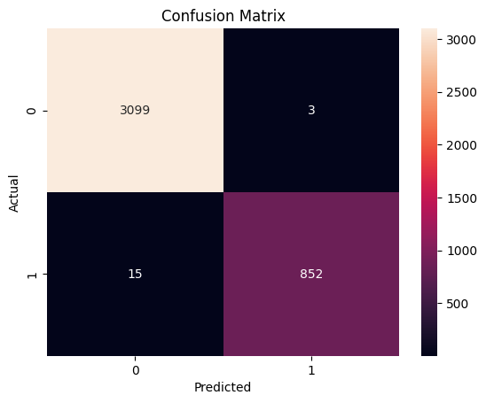
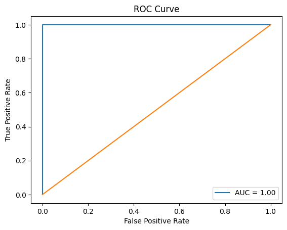
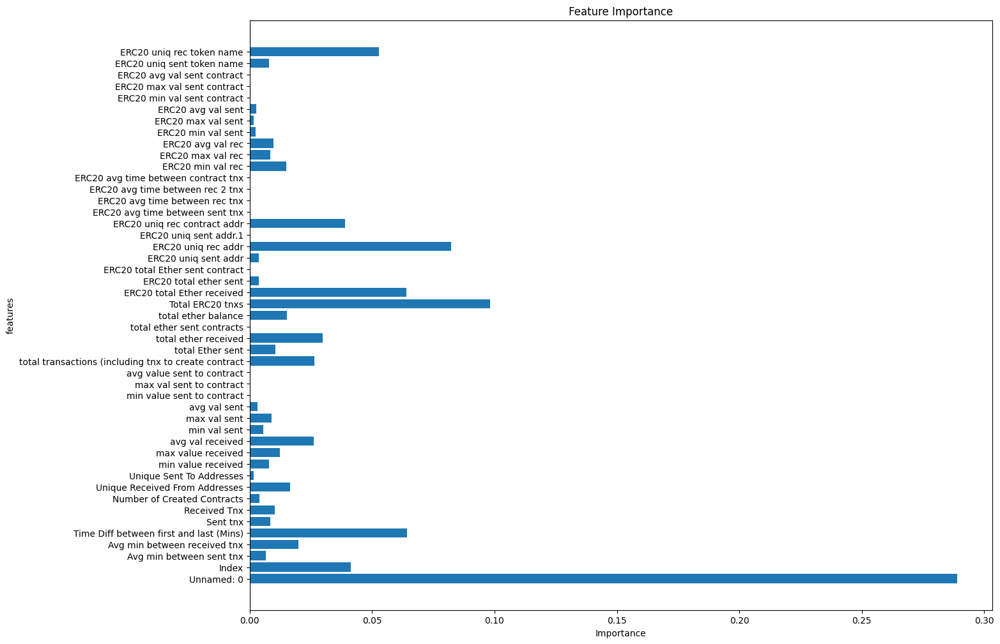

# CRYPTOCURRENCY_FRAUD_DETECTION_RANDOM_FOREST
Cryptocurrency Fraud Detection using Random Forest is a machine learning project that analyzes Ethereum transaction data to identify fraudulent activities. Using the Random Forest classifier, the model learns transaction patterns and classifies them as legitimate or fraudulent, improving security in blockchain-based financial systems.
# Cryptocurrency Fraud Detection using Random Forest

This project detects fraudulent cryptocurrency transactions using machine learning. The Random Forest classifier analyzes Ethereum transaction data and identifies patterns associated with fraudulent activity.

## Technologies Used
- Python
- Random Forest
- Pandas
- NumPy
## Results
## Model Evaluation
- Accuracy
- Confusion Matrix
- ROC Curve
- Feature Importance

### Model Accuracy

### Confusion Matrix

### ROC Curve

### Feature Importance

